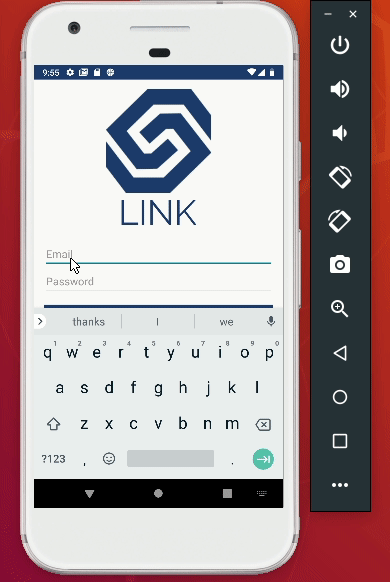
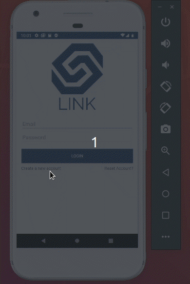
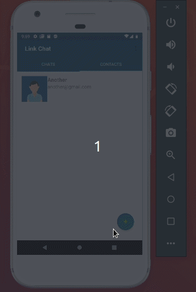
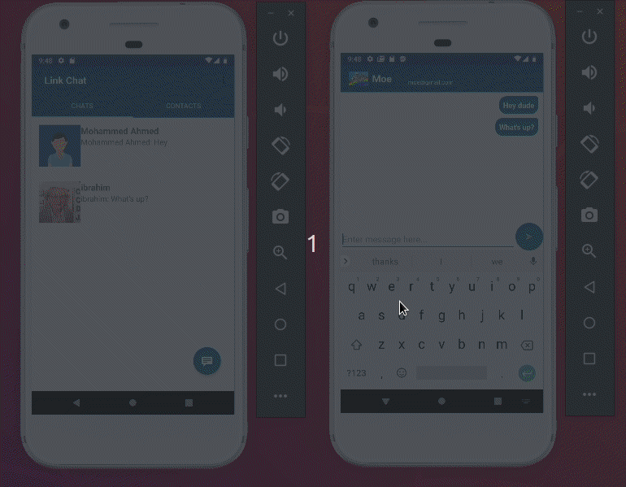

# CSCI4100 Mobile Devices Group Project - Chat App
Link Chat aims to provide UOIT/OnTechU students a fast and easy way method for cross-campus communication and group projects. As some students can be uncomfortable with sharing their personal social media or contact information, Link Chat aims to be the new messaging protocol across campuses. All registered UOIT students will appear in the Find User activity to provide quick lookup. Users added from the Find User activity will appear in your contacts activity. 

### Group Members
Ibrahim Mushtaq,
Shubham Patel,
Mohammed Ahmed

### Additional Information
Firebase/Google account:  
Username: mobiledeviceproject1@gmail.com  
Password: gitgood123

### Test User:  
Username: username@gmail.com  
Password: password 

Username: moe@gmail.com  
Password: moemoe

This project was done in pair programming. 

### How to run
1. Clone the project
2. Open Android Studio to that file
3. Run Build 
4. Run Emulator or physical device 
5. Log in using the test user providede in the README or create a new account.
6. Follow the on screeen prompt.
7. To add contacts click the plus button in the contacts tab.
8. To go to chat click the chat button in the chat tab. 

### Demo
#### Login Activity

#### Register Activity

#### Add User to Contacts

#### Chat Demo

